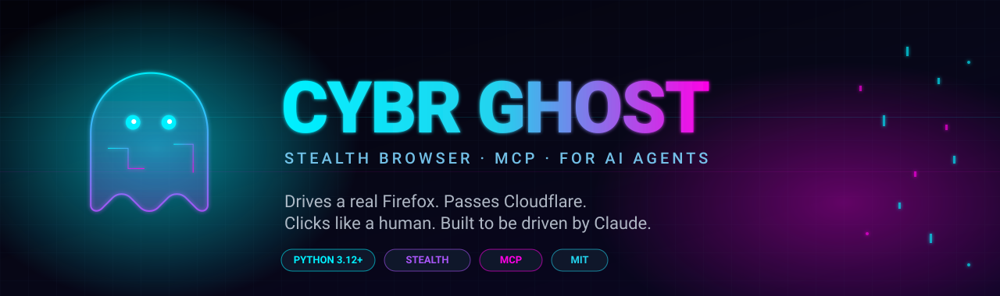
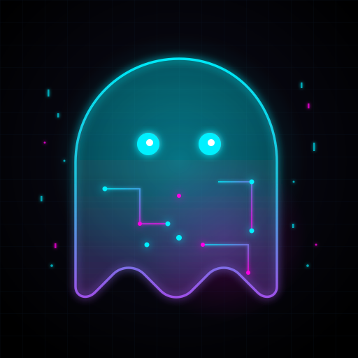
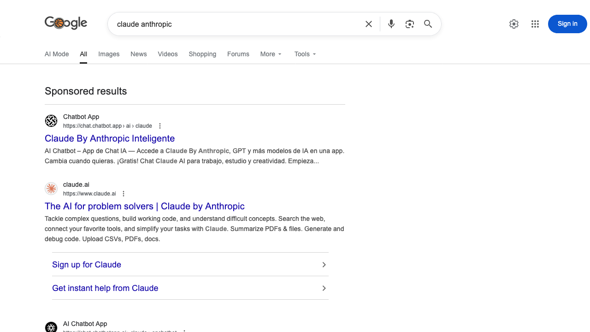
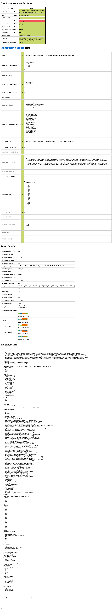

<div align="center">



<sub>Built by [**CybrFlux**](https://cybrflux.com) — AI-native engineering studio.</sub>

<br/>

**A stealth browser MCP server by [CybrFlux](https://cybrflux.com).**
**Drives a real Firefox. Passes Cloudflare. Clicks like a human. Built to be driven by Claude.**

<br/>


</div>

---

## Table of contents

- [Why CybrGhost](#why-CybrGhost)
- [Features](#features)
- [See it in action](#see-it-in-action)
- [Quickstart](#quickstart)
- [Installation](#installation)
- [Claude Code integration](#claude-code-integration)
- [Configuration](#configuration)
- [Tool reference](#tool-reference)
- [Testing](#testing)
- [Architecture](#architecture)
- [Stealth](#stealth)
- [FAQ](#faq)
- [Limitations](#limitations)
- [Roadmap](#roadmap)
- [License & attribution](#license--attribution)

---

## Why CybrGhost

Give a smart AI agent a browser and it can research prices, fill forms,
scrape data, manage portals, and run any workflow a human can drive in
Chrome. **In theory.** In practice the agent gets detected as a bot and
blocked on the second page load — Cloudflare 403, DataDome challenge,
"unusual traffic" interstitial, reCAPTCHA checkpoint.

Stock automation tooling (Playwright, Puppeteer, Selenium) leaks
`navigator.webdriver=true`, empty plugin arrays, `HeadlessChrome` in
the user-agent string, and a dozen other tells that professional
detectors check on the first JavaScript tick.

CybrGhost closes those holes. It's a **thin MCP server** that exposes
a stealth browser to any MCP-speaking client (Claude Code, Claude
Desktop, custom SDKs). You drive it; it survives detection.

<div align="center">
  
</div>

---

## Features

**Stealth**
- Clean fingerprint: `webdriver` flag absent, real `PluginArray`, real
  WebGL vendor/renderer, realistic `navigator.*` values.
- **Per-session rotation** — OS, GPU, screen, fonts, locale re-rolled
  on every launch. Same session, different "machine."
- **Humanized input** — Bezier mouse paths, pre-click dwell, per-
  character typing delay. Breaks the #1 behavioral signal.
- **Geoip-matched locale** — declared timezone and language align with
  the exit IP automatically.

**Agent-friendly**
- **Numbered element refs** — every snapshot returns
  `[0] button "Submit"`, `[1] input name=email`. Act by index. No
  selector guessing.
- **Atomic primitives** — 16 small tools (navigate/click/type/scroll/
  snapshot/screenshot/…). No opinionated "run this whole workflow"
  abstractions; Claude is the planner.
- **Stateless between calls, persistent session** — browser instance
  survives across tool calls so cookies/login state persist; each tool
  call is independently safe.

**Developer experience**
- **Zero-config MCP** — drop one stanza into `~/.claude/settings.json`,
  restart, done.
- **Real-world validated** — 9-assertion test suite covers fingerprint
  audit, real Google search, Cloudflare Turnstile challenge bypass.
- **Tiny surface area** — ~300 lines of Python. Read it in a sitting.
- **MIT licensed.**

---

## See it in action

**Google search — real results, no CAPTCHA interstitial:**

<div align="center">
  
</div>

**Fingerprint check at bot.sannysoft.com — the classic bot-detection test page:**

<div align="center">
  
</div>

---

## Quickstart

```bash
# 1. Clone + install
git clone https://github.com/CybrFlux/CybrGhost
cd CybrGhost
python3.12 -m venv .venv
.venv/bin/pip install -r requirements.txt

# 2. Fetch the stealth browser runtime (one-time, ~500MB)
.venv/bin/python -m camoufox fetch

# 3. Register with Claude Code (append to ~/.claude/settings.json)
# See "Claude Code integration" section below.

# 4. Restart Claude Code. Ask it: "Open example.com and screenshot it."
```

---

## Installation

### Requirements

- Python **3.10+** (3.12 recommended)
- macOS or Linux (Windows via WSL2)
- ~500MB disk for the browser runtime (downloaded once)

### Steps

```bash
git clone https://github.com/CybrFlux/CybrGhost
cd CybrGhost
python3.12 -m venv .venv
.venv/bin/pip install -r requirements.txt
.venv/bin/python -m camoufox fetch
```

---

## Claude Code integration

Edit `~/.claude/settings.json` and add under `mcpServers`:

```json
{
  "mcpServers": {
    "CybrGhost": {
      "type": "stdio",
      "command": "/absolute/path/to/CybrGhost/.venv/bin/python",
      "args": ["/absolute/path/to/CybrGhost/server.py"],
      "env": {
        "CYBR_GHOST_HEADLESS": "false",
        "CYBR_GHOST_HUMANIZE": "true",
        "CYBR_GHOST_LOCALE": "en-US"
      }
    }
  }
}
```

Replace `/absolute/path/to/CybrGhost` with the actual clone path.
**Restart Claude Code.** The tools surface as `mcp__CybrGhost__navigate`,
`mcp__CybrGhost__click`, etc.

---

## Configuration

All config is env-var driven so you can scope it in the MCP stanza.

| Variable | Default | Effect |
|---|---|---|
| `CYBR_GHOST_HEADLESS` | `false` | `true` hides the window. `false` shows it — useful for watching your agent work. |
| `CYBR_GHOST_HUMANIZE` | `true` | Injects humanized mouse / typing. Disable only for raw benchmarking. |
| `CYBR_GHOST_LOCALE` | `en-US` | BCP-47 locale. Matched with geoip when possible. |

---

## Tool reference

Sixteen tools, grouped. Every action tool returns a fresh page snapshot
so the model always has current ground truth.

### Navigation

| Tool | Signature | Description |
|---|---|---|
| `navigate` | `(url: str, wait_until: str = "domcontentloaded") → snapshot` | Go to a URL. `wait_until`: `domcontentloaded` \| `load` \| `networkidle`. |
| `new_tab` | `(url: str \| None = None) → snapshot` | Open a new tab. Optional URL loads immediately. Subsequent calls target this tab. |
| `list_tabs` | `() → str` | List all open tabs with indices. Active tab marked. |
| `switch_tab` | `(index: int) → snapshot` | Set active tab by index from `list_tabs`. |

### Inspection

| Tool | Signature | Description |
|---|---|---|
| `snapshot` | `() → str` | Re-snapshot current page. Use after dynamic content loads. |
| `screenshot` | `(full_page: bool = False) → image` | PNG of viewport (or full page). Use when you need to *see*, not read. |
| `get_text` | `() → str` | `document.body.innerText` — all visible text. Good for articles. |
| `get_html` | `(selector: str = "body", max_chars: int = 20000) → str` | Outer HTML of a selector, truncated. |

### Actions

| Tool | Signature | Description |
|---|---|---|
| `click` | `(index: int) → snapshot` | Click element `[N]` from the last snapshot. Humanized if enabled. |
| `type_text` | `(index: int, text: str, submit: bool = False, clear: bool = True) → snapshot` | Focus element `[N]`, clear it, type humanlike. `submit=True` presses Enter after. |
| `press_key` | `(key: str) → snapshot` | Press a key globally: `Enter`, `Escape`, `Tab`, `ArrowDown`, `Control+a`. |
| `scroll` | `(direction: str = "down", amount: int = 600) → snapshot` | `up` \| `down` \| `top` \| `bottom`. `amount` is pixels for up/down. |

### Waiting

| Tool | Signature | Description |
|---|---|---|
| `wait` | `(seconds: float = 2.0) → snapshot` | Plain sleep (capped at 30s), then snapshot. For JS-heavy pages. |
| `wait_for_selector` | `(selector: str, timeout_seconds: float = 15) → snapshot` | Block until a CSS/XPath selector appears. Fails loudly on timeout. |

### Escape hatch

| Tool | Signature | Description |
|---|---|---|
| `eval_js` | `(code: str) → str` | Run arbitrary JS in page context. Return stringified. For things the other tools can't express. |
| `close_browser` | `() → str` | Tear down the browser. Next tool call re-launches with a new session (new fingerprint). |

### Snapshot format

```
URL: https://example.com/login
Title: Sign in
Elements: 8 interactive

[0]  a href="/" "Home"
[1]  input type=email name=email placeholder="you@example.com"
[2]  input type=password name=password placeholder="Password"
[3]  a href="/forgot" "Forgot password?"
[4]  button type=submit "Sign in"
[5]  a href="/signup" "Create account"
[6]  button role=button "Settings"
[7]  a href="/help" "Help"
```

The number in `[brackets]` is what you pass to `click(N)` or
`type_text(N, "...")`. The ref persists until the next snapshot call.

---

## Testing

```bash
.venv/bin/python tests/test_stealth.py
```

Three live tests, nine assertions. Runs headless in ~60 seconds:

```
=== TEST 1: Fingerprint ===
[PASS] sannysoft/WebDriver (New)          → missing (passed)
[PASS] sannysoft/WebDriver Advanced       → passed
[PASS] sannysoft/Plugins is PluginArray   → passed
[PASS] sannysoft/plugin_count             → 5 plugins
[PASS] sannysoft/webgl                    → Google Inc. (AMD) / Radeon HD 3200

=== TEST 2: Google search ===
[PASS] google/title_has_query             → 'claude anthropic - Google Search'
[PASS] google/no_captcha                  → no block page
[PASS] google/snapshot_has_elements       → 43 interactive

=== TEST 3: Cloudflare Turnstile (nowsecure.nl) ===
[PASS] cloudflare/challenge_passed        → title='nowsecure.nl'

RESULTS: 9/9 passed
```

See [docs/STEALTH.md](docs/STEALTH.md) for the full methodology.

---

## Architecture

See [docs/ARCHITECTURE.md](docs/ARCHITECTURE.md) for the full rundown.

TL;DR:

```
Claude Code (planner) ─MCP─▶ CybrGhost server ─▶ Stealth browser runtime
```

The server holds one browser per MCP session. Every tool returns a
fresh snapshot with numbered element refs. No agent loop inside the
server — the LLM client is the agent.

---

## Stealth

See [docs/STEALTH.md](docs/STEALTH.md) for the detailed breakdown.

TL;DR:

- Fingerprint patches applied at the **C++ level**, not JS injection —
  survives `Function.prototype.toString` native-check detection.
- **Per-session profile rotation** means the same "user" doesn't show
  up twice.
- **Humanized input** breaks linear-mouse-path detection.
- What it does NOT solve: interactive CAPTCHAs (use a solver), IP
  reputation (use residential proxies), account history.

---

## FAQ

<details>
<summary><strong>Why MCP and not an HTTP API?</strong></summary>

MCP is the native protocol Claude Code and Claude Desktop speak. Zero
glue code on the client side — drop one stanza into settings.json and
Claude has 16 new tools. An HTTP wrapper would be strictly worse for
this audience.
</details>

<details>
<summary><strong>Why Firefox and not Chrome?</strong></summary>

Chrome's DevTools Protocol (CDP) leaves runtime artifacts that
detectors learned to catch. The stealth runtime patches Firefox at the
source level — the result is a browser where the "anti-bot"
values aren't patched over the top, they're native.
</details>

<details>
<summary><strong>Does this work headless?</strong></summary>

Yes. Set `CYBR_GHOST_HEADLESS=true`. Default is `false` because
watching your agent drive a real browser window is genuinely the best
way to debug an automation and builds trust in what the LLM is doing.
</details>

<details>
<summary><strong>Can I use a proxy?</strong></summary>

Not natively configured in v0.1. Drop it in via env var for the
underlying runtime (see `NOTICE`) — full first-class support is on the
roadmap.
</details>

<details>
<summary><strong>Does it preserve login state between sessions?</strong></summary>

Within a single MCP session, yes — same browser context, same cookies
across tabs. Across MCP sessions, no — each start is a fresh
fingerprint (intentional; reuse would undo rotation).
</details>

<details>
<summary><strong>Will this work against [really hard target X]?</strong></summary>

Cloudflare, DataDome, Akamai, basic reCAPTCHA — yes, empirically.
Interactive image CAPTCHAs, hCaptcha, PerimeterX — no, you need a
solver. Banking / government sites with TLS fingerprinting + account
history analysis — probably not, and you shouldn't be scraping those
anyway.
</details>

---

## Limitations

- **Interactive CAPTCHAs** not auto-solved. Pair with 2captcha or
  CapSolver for reCAPTCHA v2 image / hCaptcha.
- **No proxy config** in v0.1 (planned).
- **macOS-tested.** Linux should work but isn't in CI yet.
- **Single active tab** — `switch_tab` designates the active target.
  Simultaneous multi-tab parallel actions are a v0.2 feature.

---

## Roadmap

- **v0.2** — proxy config, persistent profiles (opt-in), CAPTCHA
  solver plugins, Linux CI.
- **v0.3** — mobile profile emulation, cookie import/export, session
  record/replay.
- **v1.0** — stable tool API, opinionated recipes (login, form-fill,
  pagination), hosted validation benchmark.

---

## License & attribution

CybrGhost is released under the [MIT License](LICENSE).

See [`NOTICE`](NOTICE) for third-party components and their licenses.

---

<div align="center">

**Built with ♥ by [CybrFlux](https://cybrflux.com).**
*Give your agents the web.*

</div>

<!-- CYBRFLUX_README_FOOTER_START -->
---

## More from CybrFlux

The full open-source family — drop-in tools for AI-native engineering, marketing, and ops:

| Product | What it does |
|---|---|
| **[CybrGhost](https://github.com/CybrFlux/CybrGhost)** | Stealth browser MCP for AI agents — drives real Firefox, passes Cloudflare |
| **[CybrScrape](https://github.com/CybrFlux/CybrScrape)** | Adaptive web scraping framework — self-healing selectors, anti-bot bypass |
| **[CybrScan](https://github.com/CybrFlux/CybrScan)** | AI website inspector — Playwright + vision model, deep design/SEO/UX analysis |
| **[CybrRoast](https://github.com/CybrFlux/CybrRoast)** | Brutal website SEO/perf/design roaster with technical scores |
| **[CybrLint](https://github.com/CybrFlux/CybrLint)** | Code-quality roaster that tells it like it is |
| **[CybrCommit](https://github.com/CybrFlux/CybrCommit)** | AI git commit message generator — never write a commit message again |
| **[CybrOutreach](https://github.com/CybrFlux/CybrOutreach)** | AI-powered personalized cold email generator |
| **[CybrVox](https://github.com/CybrFlux/CybrVox)** | Open-source voice agent framework — build voice agents in ~20 lines of TypeScript |
| **[CybrKit](https://github.com/CybrFlux/CybrKit)** | Ship your SaaS in days, not months. Production-ready Next.js starter |
| **[CybrLink](https://github.com/CybrFlux/CybrLink)** | Composio-style connector engine — data-driven integration manifests |
| **[CybrCode](https://github.com/CybrFlux/CybrCode)** | AI-powered terminal development tool — fork of Claude Code |

## License

MIT — see [LICENSE](./LICENSE).

## Maintained by CybrFlux

Built and maintained by **[CybrFlux](https://cybrflux.com)** — an AI-native engineering studio shipping production-grade open-source tools.

Questions: [`platform@cybrflux.online`](mailto:platform@cybrflux.online)

<a href="https://cybrflux.com"></a>
<!-- CYBRFLUX_README_FOOTER_END -->
